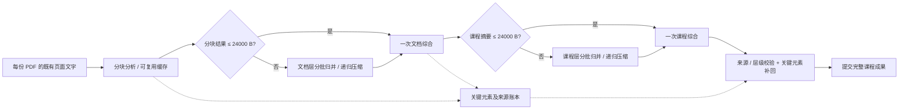

# 分层综合长文档：实现与验收

日期：2026-09-27。基线：master / `f959df8`，开工工作区干净，串行基线测试 360 通过 / 0 失败。本轮只处理分层综合；不调用真实付费 API，不修改 PDF 解析、OCR、翻译、远程访问或共享逻辑。分块器只调整预算计数并移除隐藏的 202 段截断。

## 链路及预算



| 层 | 数据分批预算 | 完整请求硬上限 | 输出约束 |
| --- | --- | --- | --- |
| 分块 | 原有 12000 字符；打包计入页码标签，超长单页继续拆段 | 48000 UTF-8 字节 | 既有 8192 tokens；glm-4.6v 仍为 32768 |
| 文档 | 每批 JSON ≤24000 字节 | 64000 UTF-8 字节 | 中间包 ≤10000 字节；最终结果沿用既有输出 token 上限 |
| 课程 | 每批 JSON ≤24000 字节 | 64000 UTF-8 字节 | 同文档层 |

完整请求按序列化 messages 测量，包含系统提示词、术语表、来源、schema、纠错信息。字节预算是可重复的保守度量，不是特定模型 tokenizer 或上下文容量的保证；供应商上下文更小仍可能拒绝。输出 token 预留沿用已有规则。

超限按章节摘要、独立要点、概念、关系的 schema 边界打包，不截字符串、公式或表格。超过一批的结果逐批串行归并；中间包继续超限则再归并，最多 8 轮。不可拆分的单项超过 24000 字节、完整提示词超限、结果不收缩或达到轮次上限时，明确拒绝发布并提供重试入口。短文档仍是一轮分块分析加**一次**文档综合；短课程只综合一次。

## 来源、质量及成果

- 所有层携带应用维护的 provenance（documentId、文件名、真实页码区间），相邻区间可以合并，页码空隙保留。模型输出不得引用本批没有提供的来源；文档来源身份由应用规范化。
- 概念身份复用 `concept-identity.ts`，与 `course-merger` 一致，保留数学符号差异；规范化时重映射关系和 parentId。相同概念保留原有来源，已被范围覆盖的来源不重复追加。
- 最终输出仍执行上一轮脑图契约：主题→一级→二级→要点；深度至多 3，每个非叶节点 ≤9 个直接子节点；有章节结构的输入不能伪报 flat。合格平坦材料不强加层级。
- 结构化 points 全部保留；从原始页面及摘要保守识别 LaTeX、公式等式、GFM 表格、定义、定理、结论段落，建立逐字证据账本。每次归并检查遗漏，最终在总结的“关键元素（来源原文保留）”附录补回，而不是增加脑图分支。课程界面的附录带 PDF 来源跳转，Markdown 导出包含原公式、表格和来源。
- 证据账本独立于压缩提示词保存；已补回的文档附录不会重复塞进课程请求。课程请求提供保留项计数，最终成果仍带完整账本。大量证据可能使成果文件变大，这是避免丢失内容的明确取舍。
- 这种检查保证被识别元素与结构化要点的逐字保留，不等价于完整语义覆盖评估；未标记自然语言结论、OCR 已丢失的符号或非文本表格仍需人工核对。没有重写解析或 OCR 来补造证据。

## 断点、取消、缓存和诊断

每个校验通过的完整分块/中间包才写入 IndexedDB；旧格式、损坏包、过期提示词的缓存视为未命中。键包含层级、轮次/分组身份、完整输入与术语表、provider 和 endpoint、model、提示词版本（digest v5、course v4、hierarchical v1）。不包含 API Key。最终旧文档缓存保持可读，新版本不命中旧提示词结果。

用户取消通过 AbortSignal 传到请求；不配合取消的迟到响应也被拒绝。失败或取消保留已完成层，未完成层明确丢弃；重试复用缓存。主动“重新生成”绕过缓存；失败后的“重试生成”跳过旧最终摘要，但复用本次成功的层，避免误把旧成果当成重试成功。缓存不可用会给出诊断，生成继续，跨重试复用不保证。

课程文件、版本与历史只在完整结果返回后交给现有存储层；模型处理失败或取消不会提交半成品。进入保存阶段后禁用导入取消按钮，不在已有提交中途打断。已有删除文档流程的失败清理语义保持原样。

诊断通过 `onDiagnostic`、异常的 `diagnostics`、成功摘要/课程成果的 `diagnostics` 提供；UI 可展开查看。字段包括 layer、identity、action、inputBytes、outputBytes、limit、droppedItems、droppedBytes、detail，关键元素补回还有来源、字节数和预览。失败诊断留在本次界面/异常中；成功诊断随成果落盘。

- 输入超限：记录层、分组/结构项、大小和来源，输入丢弃量为 **0**；继续分组或明确失败。
- 输出截断/校验失败：记录被丢弃的模型响应条数及精确 UTF-8 字节数；原始输入及已完成层不丢失。校验失败最多定向纠错一次，纠错请求也受完整消息预算限制。
- 关键元素遗漏：记录遗漏项和来源，补回证据账本，最终内容丢弃量为 **0**。
- request / completed / cache-hit：可观察调用层次、输出规模和重试复用。

## Mock 夹具对比

`tests/fixtures/hierarchical-synthesis.ts` 提供长讲义、含公式表格的论文、历史长摘要；全部请求走 mock provider。

混合夹具：一份 6 分块长讲义 + 两份各 12 节的历史长论文摘要。

旧实现把六份分块结果一次塞进文档综合（仅分块 JSON 约 80 KB），然后把约 **202737 B** 的三份文档摘要一次塞进课程综合。对只能接受 64000 B 输入的模拟上下文容量，这两个单次汇总都会超限；真实供应商可能拒绝或给出压缩不充分/截断的输出。本轮没有将该条件推断冒充真实模型失败实测。

新实现完整链路 **24 次调用**：

| 阶段 | 次数 | 实际完整请求大小 | mock 单次模型输出大小 |
| --- | --- | --- | --- |
| 分块 | 6 | 每次 30275 B | 每次 13453 B |
| 文档中间归并 | 4 | 18761–28762 B | 每次 475 B |
| 文档最终综合 | 1 | 7598 B | 475 B |
| 课程中间归并 | 12 | 21585–22873 B | 475–566 B |
| 课程最终综合 | 1 | 13594 B | 655 B |

这些输出大小是 mock 返回的 JSON，不含应用追加的 provenance、证据账本和诊断；不是对真实摘要质量或 token 用量的预测。另一组三份历史长摘要合计 295393 B，课程层为 18 次中间归并 + 1 次最终综合。测试输出含 `MIXED_HIERARCHY_METRICS`，可重复核对。

## 自动验证与人工验收

新增 `hierarchical-synthesis.test.ts`：17 项测试，覆盖调用次数、各层预算、原子项超限、拒绝非收缩归并、超长单页无隐性截断、页码标签预算、来源保留、元素补回、缓存身份/旧缓存、分块/文档/课程取消、存储不变、强制重生成失败后恢复、输出截断诊断与短路径。

更新已有 AI/脑图测试以适配提示词版本与正确的夹具来源；扩展 Electron 导入回归，实际点击重试/取消，检查三层进度与旧课程不变。原有单 PDF、课程综合、术语表、公式表格渲染、来源跳转及存储回归继续执行。

最终验证：377 通过 / 0 失败 / 0 跳过（串行，约 32.08 秒）；lint 0 错误、34 条存量告警；tsc 0 诊断。所有 provider 均为 mock。命令：

```bash
cd demo
xvfb-run -a pnpm test
pnpm lint
pnpm exec tsc --noEmit
```

人工验收：

1. 配置独立的知识库 AI，先保留一份已有课程成果。导入自己的长讲义并勾选“纳入课程”，再加入包含公式/表格的论文。
2. 查看“分块层 / 文档层 / 课程层”进度。展开分层生成诊断，核对 split、每次输入预算和完整层 completed；短文档不应出现额外分层。
3. 在文档层或课程层取消。检查旧总结、脑图、版本及已导入文件仍在，随后点击重试，检查 cache-hit 和后续归并。
4. 对照原 PDF 核查公式、表格行列/单位/脚注、定义与结论；查看关键元素附录，点击文件名/页码应跳回正确 PDF 页。
5. 检查 structured 脑图的四级结构和每分支 ≤9，重复概念合并后仍保留多份来源，用户节点和关系仍在。导出 Markdown 核对完整表格。
6. 检查术语表译名是否进入各层；改术语表/模型后应重算相应层。若完整表格等单项超限，应显示来源、大小与明确失败，旧成果不变。

真实模型仍需确认：不同供应商上下文余量、中间输出能否稳定压到 10000 B、长篇材料的语义覆盖、归并深度与概念组织质量、复杂公式/表格的原始提取质量、实际费用与耗时。本轮未调用付费 API。

## 2026-09-27：结构修复与服务商上下文自适应

- 结构校验失败时，重试发送实际失败的节点、父子关系、章节依据及校验详情，专门修复脑图。应用保留原摘要、公式、已有节点解释与来源，以及独立横向关系；修复不得遗漏已有节点。完整校验通过后才保存。提示词明确主题根由应用生成，章/节/要点对应深度 1/2/3。
- 服务商返回输入上下文不足（400/413/422）或本地完整请求超预算时，分块层将失败分块继续拆小，文档与课程层将失败批次按结构边界再归并。最多递归缩小 5 层，并在输入过小、不可继续拆分或归并不收缩时停止；鉴权、限流、取消等不触发拆分。
- 当错误明确涉及输出预留与上下文容量冲突时，先降低输出预留，最低 1024 tokens。仍截断的输出继续拒绝保存。术语提示只选择本批命中的条目，减少无关上下文。
- 分块重试保留原页码，避免拆断 Unicode 代理对；综合摘要头单独成为批次时也携带实际来源。旧的超大原子公式/表格仍不静默截断。
- 回归测试模拟截图中的 15 个根分支、最大深度 2，以及小上下文服务、长中文和补充字符、文档/课程多层缩小、输出预留冲突和来源保留。测试使用模拟服务，未调用真实付费模型；实际模型仍可能返回无法修复的结构，此时保留旧成果并显示错误。

本轮全量验证还发现矮窗口中 AI 输入框与固定留白会把发送按钮挤出面板，已增加低高度布局；浏览器测试验证粘贴 200 行文本后输入完整保留，输入框及发送按钮均在面板内。最终 `xvfb-run -a pnpm test` 为 **386 通过 / 0 失败 / 0 跳过**；文档测试 16 通过；类型检查、Lint、`desktop:web` 和 `desktop:compile` 均通过，Lint 保留 34 条已有警告。
