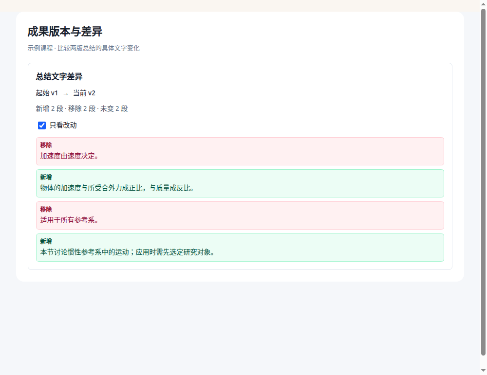

# DSH CLI 与 GPT-6 Luna：同题开发对比

日期：2026-10-03。基线提交：`8a669d7`。用户授权两种执行者分别完成同一任务，由主 Agent 独立评估、集成与提交。

## 本轮结论

这一个真实功能包中，DSH 交付更快，独立验收的正确性打平。Luna 的实现对矩阵内存和计算缓存处理更细致。现有「DSH 执行基础任务、主 Agent 审查集成」的分工可以继续使用；本轮不能证明哪个模型整体更强。

任务包含两个连接的改进：课程历史总结的逐段文字差异，以及长差异列表的只看改动/每次展开 20 段。没有把不同难度的任务分别交给两边计分。

## 环境与方法

| 项目 | DSH | Luna |
| --- | --- | --- |
| 执行入口 | 已安装 `dsh --profile headless` | `collaboration.spawn_agent` |
| 实际配置 | CLI `0.1.5-rc.2`，`deepseek-official / deepseek-flash`，`reasoningEffort: high` | `gpt-6-luna`，`reasoning_effort: max` |
| 输入 | 相同 TASK.md、TypeScript 接口、3 项公共测试及依赖 | 相同 |
| 工作区 | 独立临时目录 | 独立临时目录，不继承主对话 |
| 初次执行期限 | 600 秒，TERM 后 10 秒 KILL | 任务中明确 10 分钟 |
| 范围 | 纯算法、独立 React 组件及测试；无依赖安装、提交、发布 | 相同 |

使用的是工具实际可调用的 GPT-6 Luna，本轮没有运行 GPT-5.6 Luna。DSH CLI 的版本也不是应用内固定 SDK 运行时的版本。

两边初次产物均只修改允许的源码与测试，没有改任务说明、类型检查或 lint 配置。主 Agent 没有向任一执行者透露另一方答案，也没有在初次验收前修改它们的实现。

## 实际结果

| 观察项 | DSH | GPT-6 Luna |
| --- | --- | --- |
| 初次交付耗时 | 186.62 秒（进程计时，约 3 分 7 秒） | 约 458 秒（派发至收到完成消息，约 7 分 40 秒） |
| 独立算法验收 | 14/14 | 14/14 |
| 独立真实 Chromium 交互验收 | 通过 | 通过 |
| 独立 TypeScript / lint | 通过 / 通过 | 通过 / 通过 |
| 持久化自测，主 Agent 重跑 | 31/31，包含 SSR 界面用例 | 10/10；另报告临时 SSR 检查，界面由统一浏览器验收覆盖 |
| 根据验收反馈返工 | 0 次 | 0 次 |

独立算法验收包含：换行与空白、代码围栏、显示公式、未关闭块、重复段落、删除优先的确定性顺序、共享前后缀、阈值降级、5,000 段相同输入，以及 160 组确定性生成用例的双向重建与最长公共子序列长度。

浏览器验收包含：默认 20 段、连续展开、只看改动、原始文字转义、内容变化后重置、仅标签变化保留控件状态、空内容/相同内容/简化差异提示，以及真实键盘空格切换复选框。

初版验收工具自身有三处修正：重复段落预期没有遵循任务要求的公共后缀保留；只查 `aria-label` 漏掉合法的 `aria-labelledby`；浏览器计数断言需修正。核对后用同一最终脚本重测双方，未修改执行者代码，这些失败不计入执行者返工。脚本摘要和修正记录保存在 `benchmark-manifest.json`。

## 代码审查与集成选择

- Luna 使用恰好对应比较区域的 `Uint32Array`，空边界无需额外矩阵；组件用 `useMemo` 缓存差异计算。
- DSH 使用易读的二维数组；界面提供明确的红绿增删提示、文字标签和焦点样式，持久化测试涵盖更多输入及 SSR 状态。初稿每次控件更新会重新计算差异。
- 最终采用 Luna 的算法、DSH 的界面及测试，并由主 Agent 补上计算缓存、临时测试产物清理和独立验收回归。
- 主 Agent 将组件接入课程历史：完整快照比较实际总结；旧版本缺少完整总结时，双方统一退到知识点说明并明确提示；刷新后目标历史消失，选择器回到当前版本。

## 可复查产物

- [共同任务说明](TASK.md)
- [DSH 初次原始产物](dsh-initial.patch)
- [Luna 初次原始产物](luna-initial.patch)
- [独立算法验收](acceptance.test.mjs)
- [独立浏览器验收](browser-acceptance.test.mjs)
- [输入及验收摘要](benchmark-manifest.json)

两个 patch 都是向空任务目录添加 `lib/`、`components/` 和 `tests/` 的完整初稿，可分别用 `git apply` 还原。给还原目录添加 `{"type":"module"}` 的 package.json，并将 node_modules 指向项目已安装依赖；以绝对路径设置 `TASK_ROOT` 后运行对应验收脚本。算法脚本需要 Node 22 的 `--experimental-strip-types`，浏览器脚本需要 Electron 与显示环境或 Xvfb。不要将候选 patch 直接应用到已经集成的主工作区。

未保存原始推理日志、凭据或私人配置到仓库。

## 解读限制

- 只有一个功能包、每边一次初始执行，不是多次统计结果。
- 两套执行工具、服务、推理档位和完成通知方式不同；耗时包含相应环境开销，不是纯推理速度排名。
- 自测数量不能直接作为质量分数，统一验收才是可对照的部分。
- 没有可靠的共同 token/费用记录，不比较成本。未验证复杂存储重构或大型跨模块任务的模型优势。

## 项目验证

- 全量测试：761 通过、0 失败、0 跳过；新功能定向回归 47 通过。
- TypeScript 通过；lint 0 错误、40 条警告，与此前总数相同。
- 已查看实际组件截图；820px 窗口检查无水平溢出。
- Python 文档测试 16 通过；Linux x64 桌面构建成功，编译版、打包版及后台启动验证 19 通过。
- 两份归档 patch 已在空目录实际还原，并逐文件核对与初始产物一致。
- 本轮代码与报告已保存到 Git；桌面包已生成，没有覆盖安装或推送远程。
